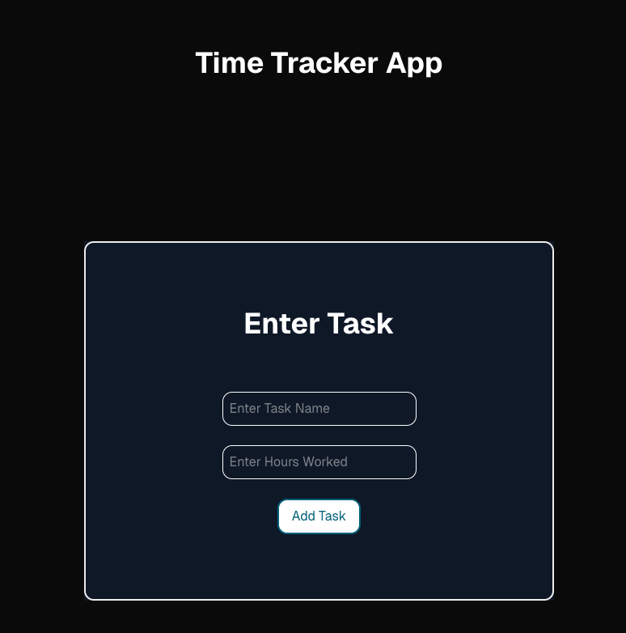
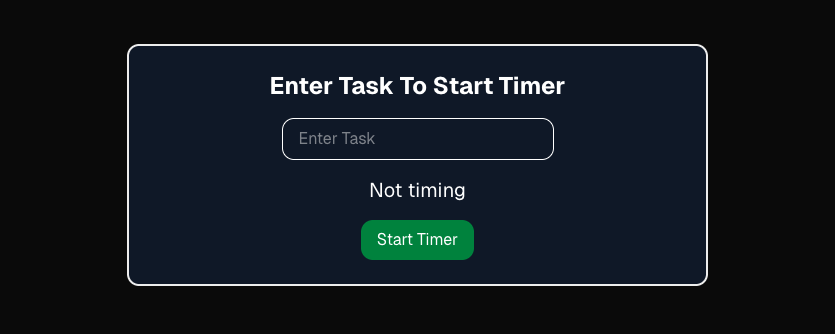
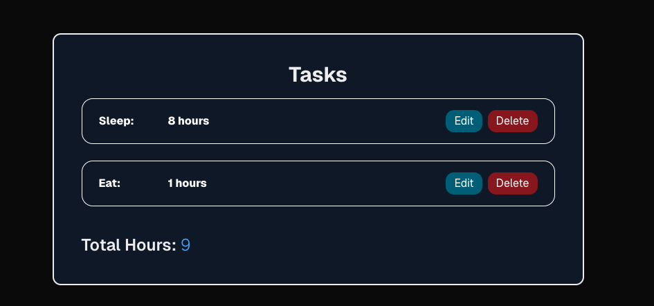

# Mini Time Tracker
A lightweight, client-side web app that allows users to track their time. The web app was built with Next.js, TypeScript, Tailwind CSS and Zustand. 
Users can track their time by manually logging their tasks and hours or using the timer function whereby they can add the task and start a timer. The app has a dashboard with a summary of all tasks and hours. 

## Features:

- Add a task and the hours worked via the Task form. 
- Timer to log tasks and the hours in real time.
- Edit, save and delete task entries. 
- View total hours worked (accurate to 4 decimal places)
- Full dark mode UI. 
- Responsive design for mobile, tablets and desktop. 
- State persistence using Zustand - no backend. 

## Tech Stack:

- [Next.js] - (https://nextjs.org)
- [TypeScript] - (https://www.typescriptlang.org/)
- [Zustand] - (https://github.com/pmndrs/zustand)
- [TailwindCSS] - (https://tailwindcss.com/)
- [Zod] - (https://zod.dev/) (schema validation)

## Screenshots

|  |  |

|  |  |

## Live Demo
[Visit the live app on Vercel] - (https://mini-time-tracker-two.vercel.app/)

## Getting Started 

### 1. Clone the repository

git clone https://github.com/your-username/mini_time_tracker.git
cd mini_time_tracker/time-tracker-app

### 2. Install dependencies

Make sure you have Node.js installed, then run:
npm i

### 3. Start the development server
npm run dev 

### 4. Open your browser
http://localhost:available-port eg. http://localhost:3000